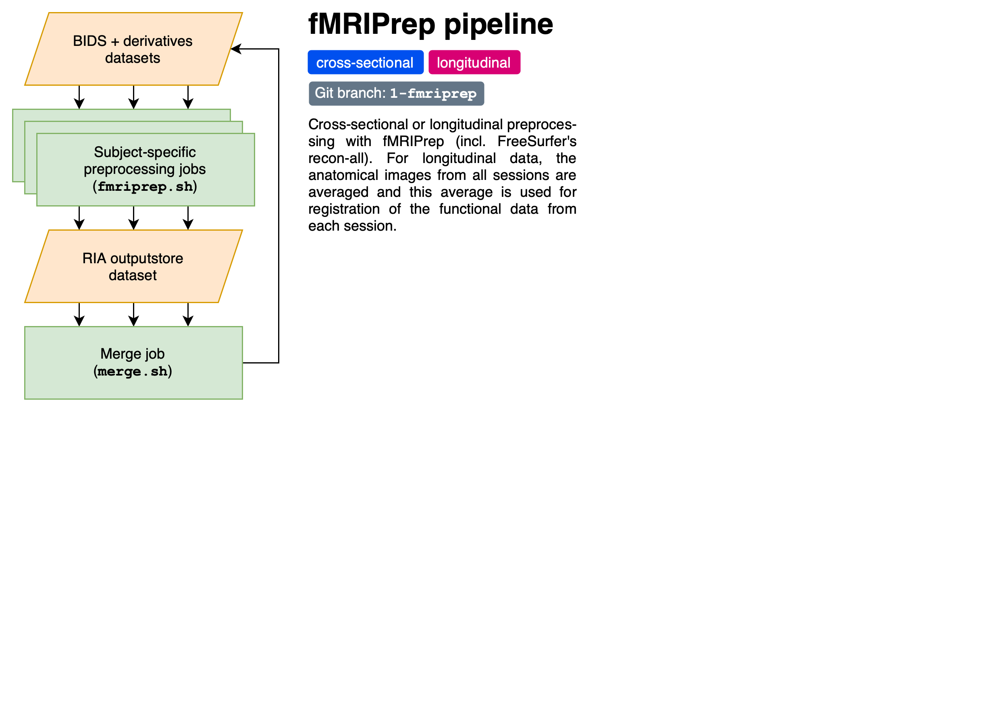

# derivatives_template_code

[](LICENSE)
[](https://www.repostatus.org/#wip)

Scripts for preprocessing fMRI data

## Installation

### Prerequisites

* A [DataLad](https://www.datalad.org) dataset with fMRI data in [BIDS format](https://bids-specification.readthedocs.io/en/stable/), which you can either create using our [BIDS template](https://github.com/SkeideLab/bids_template) or download from [OpenNeuro](https://openneuro.org) (the latter currently untested)
* A basic understanding of the DataLad tool for data management, e.g., from the [DataLad Handbook](http://handbook.datalad.org/en/latest/)

### If you already have a `derivatives` sub-dataset

* If using our BIDS template, your BIDS dataset probably already has a sub-dataset called `derivatives` installed
* You can install the scripts from this repository using the following command from your main BIDS directory:

    ```bash
    datalad install -d . -s https://github.com/SkeideLab/derivatives_template_code.git derivatives/code
    ```

### If you don't have a `derivatives` sub-dataset

* If you don't have a `derivatives` sub-dataset installed in your BIDS dataset, you can do so using the following command from your main BIDS directory:

    ```bash
    datalad create -d . derivatives
    ```

* Next, you can install the scripts from this repository using the following command:

    ```bash
    datalad install -d . -s https://github.com/SkeideLab/derivatives_template_code.git derivatives/code
    ```

## Usage

1. Update your study-specific preprocessing options in the [`run_params.json`](run_params.json) file in the `derivatives/code` directory.
Currently supported options for this pipeline are:

    | Parameter         | Meaning                                           | Example value                 |
    | ----------------- | ------------------------------------------------- | ----------------------------- |
    | `"license_file"`  | Path of your [FreeSurfer license file][1]         | `"/u/username/license.txt"`   |
    | `"fd_thres"`      | [FD][2] threshold for marking volumes as outliers | `2.4` (2.4 mm, ~1 voxel size) |
    | `"output_spaces"` | Desired [standard/non-standard output spaces][3]  | `["T1w", "fsaverage"]`        |

2. Run the [`run.py`](run.py) script in the `derivatives/code` directory, either from the command line (`python3 run.py`) or code-cell for code-cell using the [interactive Python window](https://code.visualstudio.com/docs/python/jupyter-support-py) in VS Code

[1]: https://surfer.nmr.mgh.harvard.edu/registration.html
[2]: https://mriqc.readthedocs.io/en/latest/iqms/bold.html#measures-for-artifacts-and-other
[3]: https://fmriprep.org/en/stable/spaces.html

## Processing details

* Each pipeline is on its own git branch, starting with the numbers going from simpler to more complex pipelines
* If you want to tailor a pipeline to your specific project, please create a new branch from it, named after your project
* For details about the preprocessing steps on the current branch, please see [`run.md`](run.md) (the Markdown sibling of the `run.py` script)


